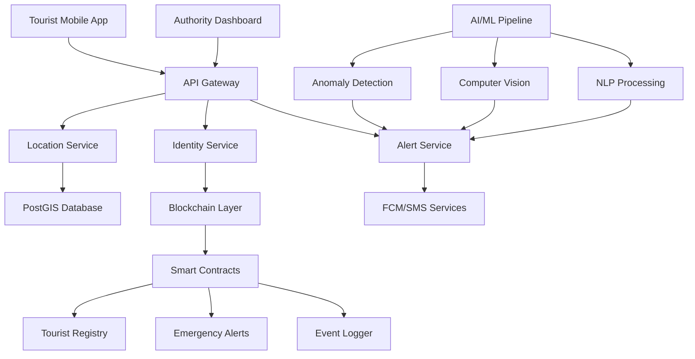

<table>
  <tr>
    <td></td>
    <td>
      <h1>WanderSecure</h1>
      
<strong>Smart Tourist Safety Monitoring & Incident Response System</strong>

    </td>
  </tr>
</table>

---

> A comprehensive AI-powered, blockchain-secured tourist safety ecosystem leveraging geofencing, anomaly detection, and real-time monitoring to ensure tourist safety across India's diverse travel destinations.

## Vision Statement

WanderSecure transforms tourist safety management through cutting-edge technology, creating an intelligent ecosystem where artificial intelligence, blockchain security, and real-time monitoring converge to protect travelers while preserving their privacy and freedom to explore.

## Problem Statement

Traditional tourist safety management faces critical challenges:
- **Manual tracking methods** insufficient for remote and high-risk areas
- **Delayed emergency response** due to lack of real-time monitoring
- **Privacy concerns** with existing tracking solutions
- **Communication gaps** between tourists, authorities, and emergency services
- **Limited coverage** in Northeast India's diverse terrain and tourist hotspots

WanderSecure addresses these challenges with a technology-driven approach that ensures **real-time monitoring**, **rapid response**, and **secure identity verification** while maintaining **privacy** and **ease of travel**.

---

## System Architecture

---

## Core Features

### **Digital Tourist ID System**
- **Blockchain-secured identity** verification using Hedera Hashgraph
- **KYC integration** with Aadhaar/Passport validation
- **Privacy-first approach** with encrypted hash storage
- **Temporary IDs** valid only for visit duration

### **Smart Mobile Application**
- **Real-time GPS tracking** with 3-5m accuracy
- **Geofencing alerts** for restricted zones
- **One-touch SOS button** with live location sharing
- **Safety scoring** based on travel patterns
- **Multilingual support** (10+ Indian languages + English)
- **Offline functionality** with cached maps

### **Authority Command Center**
- **Real-time tourist heatmaps** and cluster visualization
- **Incident management** with automated E-FIR generation
- **Live monitoring dashboards** with customizable views
- **Emergency response coordination** tools
- **Historical analytics** and reporting

### **AI-Powered Anomaly Detection**
- **Location anomalies**: Route deviations, prolonged inactivity
- **Behavioral analysis**: Speed variations, isolation detection
- **Pattern recognition**: Time-based and location-based abnormalities
- **Predictive alerts** for potential emergency situations

### **Computer Vision Intelligence**
- **Fire & smoke detection** using YOLOv8 models
- **Crowd counting** with CSRNet for density estimation
- **Event tracking** using I3D networks
- **Face recognition** for tourist identification (opt-in)

### **Social Media Intelligence**
- **Real-time monitoring** of official channels (Twitter, Reddit)
- **NLP processing** with VADER sentiment analysis
- **H3 grid mapping** for hyperlocal anomaly detection
- **Automated alert correlation** with social media events

### **Multi-Channel Alert System**
- **Firebase Cloud Messaging** for instant app notifications
- **SMS alerts** via telecom APIs
- **Email notifications** for detailed incident reports
- **Emergency service integration** with 112 helpline
- **Escalation matrix** based on severity levels

---

## Technology Stack

### **Frontend**
- **Mobile**: React Native (iOS/Android)
- **Web Dashboard**: React.js with Vite
- **Maps**: Google Maps API, Mapbox
- **UI Framework**: Material-UI, Native Base

### **Backend**
- **API Gateway**: Node.js with Express
- **Microservices**: Node.js, Python
- **Database**: PostgreSQL with PostGIS extension
- **Cache**: Redis for real-time data
- **Message Queue**: Apache Kafka

### **AI/ML Stack**
- **Computer Vision**: YOLOv8, CSRNet, I3D
- **NLP**: SpaCy, VADER, Transformers
- **Anomaly Detection**: Isolation Forest, PyOD
- **ML Ops**: MLflow, Docker containers
- **Data Processing**: Apache Spark, Pandas

### **Blockchain**
- **Primary**: Hedera Hashgraph
- **Smart Contracts**: Solidity
- **Development**: Hardhat framework
- **Wallet Integration**: MetaMask, WalletConnect

### **Infrastructure**
- **Containerization**: Docker, Docker Compose
- **Orchestration**: Kubernetes
- **Cloud**: AWS/Azure/GCP
- **IaC**: Terraform
- **Monitoring**: Prometheus, Grafana, ELK Stack

---

## Quick Start

### Prerequisites - (To be used)
- **Node.js** v16+ and npm
- **Python** 3.8+ with pip
- **Docker** and Docker Compose
- **PostgreSQL** 13+ with PostGIS
- **Redis** 6+

## System Components

### 1. **Tourist Mobile App** (`/frontend/mobile-app`)
- GPS tracking with background location services
- Geofencing with automatic zone detection
- Emergency SOS with one-touch activation
- Digital ID wallet with secure storage
- Offline maps and emergency contacts

### 2. **CCTV Integration** (`/ai-ml/computer-vision`)
- Real-time video stream processing
- Fire/smoke detection algorithms
- Crowd density monitoring
- Incident event recognition
- Integration with existing surveillance infrastructure

### 3. **Geospatial Services** (`/backend/location-service`)
- PostGIS-powered location queries
- Google Earth Engine integration
- Dynamic geofence management
- Spatial analytics and reporting
- Route optimization algorithms

### 4. **Authority Dashboard** (`/frontend/web-dashboard`)
- Real-time tourist location mapping
- Incident heatmap visualization
- Emergency response coordination
- Resource allocation optimization
- Historical trend analysis

### 5. **Alert Management** (`/backend/alert-service`)
- Multi-channel notification delivery
- Priority-based alert routing
- Emergency responder coordination
- Escalation workflow management
- Communication fallback systems

### 6. **AI Anomaly Engine** (`/ai-ml/anomaly-detection`)
- Machine learning-based pattern recognition
- Real-time behavioral analysis
- Predictive risk assessment
- Continuous model improvement
- Context-aware decision making

### 7. **Blockchain Security** (`/blockchain`)
- Immutable identity verification
- Tamper-proof event logging
- Smart contract automation
- Decentralized trust network
- Privacy-preserving transactions

---

## Privacy & Security

### **Data Protection**
- **End-to-end encryption** for all communications
- **Zero-knowledge architecture** for location data
- **GDPR compliance** with data minimization
- **User consent management** with granular controls
- **Regular security audits** and penetration testing

### **Blockchain Security**
- **Immutable logging** of all emergency events
- **Hash-based identity** protection
- **Smart contract verification** for transactions
- **Decentralized storage** prevents single point of failure
- **Audit trails** for regulatory compliance

### **Access Control**
- **Role-based permissions** for different user types
- **Multi-factor authentication** for authorities
- **API rate limiting** and DDoS protection
- **Secure token management** with JWT
- **Network isolation** between services

---

## Multi-Language Support

WanderSecure supports comprehensive multilingual functionality:

**Supported Languages:**
- Hindi, English, Assamese, Bengali, Manipuri
- Gujarati, Marathi, Tamil, Telugu, Malayalam
- Voice-to-text emergency features
- Cultural context adaptation
- Regional emergency protocol integration

---

## Performance Metrics

### **System Capabilities**
- **Response Time**: < 2 seconds for emergency alerts
- **Location Accuracy**: 3-5 meters in optimal conditions
- **Scalability**: 100,000+ concurrent users
- **Uptime**: 99.9% availability SLA
- **Coverage**: Pan-India including remote areas

### **AI Model Performance**
- **Anomaly Detection**: 94% accuracy with low false positives
- **Computer Vision**: 90%+ precision for fire/smoke detection
- **NLP Processing**: Real-time social media analysis
- **Predictive Alerts**: 85% accuracy for risk assessment

---

## Roadmap

### **Phase 1: Foundation** (Q1 2026)
- [ ] Core mobile app with basic GPS tracking
- [ ] Simple web dashboard for authorities
- [ ] Basic geofencing implementation
- [ ] Initial blockchain smart contracts

### **Phase 2: Intelligence** (Q2 2026)
- [ ] AI anomaly detection integration
- [ ] Computer vision pipeline deployment
- [ ] NLP social media monitoring
- [ ] Advanced alert correlation system

### **Phase 3: Scale** (Q3 2026)
- [ ] Multi-state deployment
- [ ] IoT wearable integration
- [ ] Satellite communication backup
- [ ] Advanced analytics and reporting

### **Phase 4: Innovation** (Q4 2026)
- [ ] AR/VR safety features
- [ ] Predictive tourism safety modeling
- [ ] International expansion framework
- [ ] Advanced AI autonomous response

---

## Contributing

We welcome contributions from developers, researchers, and domain experts!

### **Getting Started**
1. Fork the repository
2. Create a feature branch: `git checkout -b feature/amazing-feature`
3. Make your changes and commit: `git commit -m 'Add amazing feature'`
4. Push to your branch: `git push origin feature/amazing-feature`
5. Open a Pull Request

### **Development Guidelines**
- Write comprehensive tests
- Update documentation
- Follow security best practices
- Maintain backward compatibility

### **Areas for Contribution**
- Mobile app development (React Native)
- AI/ML model improvement
- Blockchain smart contract optimization
- UI/UX design enhancements
- Documentation and tutorials
- Performance optimization
- Security enhancements

---

## License

This project is licensed under the **MIT License** - see the [LICENSE](LICENSE) file for details.

---

## Acknowledgments

- **Tourism Departments** of Northeast India for domain expertise
- **AI Research Community** for open-source models and datasets
- **Blockchain Developers** for security framework guidance
- **Emergency Services** for operational insights and testing
- **Local Communities** for cultural context and feedback

---

## Contact & Support

### **Project Maintainers**
- **Development Team**: dev@wandersecure.com (TO BE UPDATED)
- **Security Team**: security@wandersecure.com (TO BE UPDATED)
- **Business Inquiries**: business@wandersecure.com (TO BE UPDATED)

### **Emergency Support**
- **24/7 Technical Support**: +91-XXX-XXX-XXXX (TO BE UPDATED)
- **System Status**: https://status.wandersecure.com (TO BE UPDATED)
- **Documentation**: https://docs.wandersecure.com (TO BE UPDATED)

### **Community**
- **GitHub Discussions**: [Project Discussions](https://github.com/pranav271103/WanderSecure/discussions) - (TO BE UPDATED)
- **Discord Server**: [WanderSecure Community](https://discord.gg/wandersecure) - (TO BE UPDATED)
- **Twitter**: [@WanderSecure](https://twitter.com/wandersecure) - (TO BE UPDATED)

---

**Made by WanderSecure for safer tourism experiences across incredible India**

---

*Last updated: September 20, 2025*